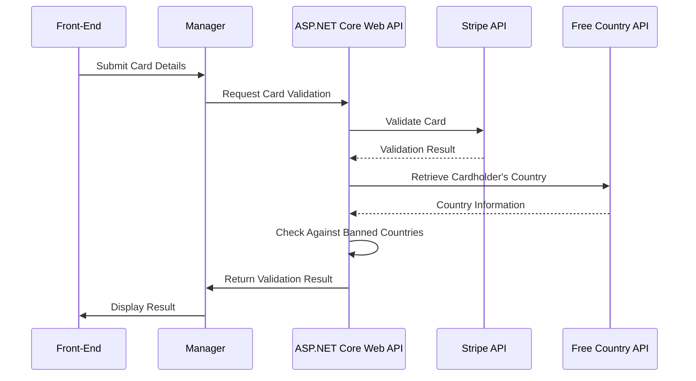

Credit Card Validation API

```mermaid
sequenceDiagram
    participant Client as Front-End
    participant Manager as Manager
    participant Engine as ASP.NET Core Web API
    participant Stripe as Stripe API
    participant CountryAPI as Free Country API

    Client ->> Manager: Submit Card Details
    Manager ->> Engine: Request Card Validation
    Engine ->> Stripe: Validate Card
    Stripe -->> Engine: Validation Result
    Engine ->> CountryAPI: Retrieve Cardholder's Country
    CountryAPI -->> Engine: Country Information
    Engine ->> Engine: Check Against Banned Countries
    Engine ->> Manager: Return Validation Result
    Manager ->> Client: Display Result
```
